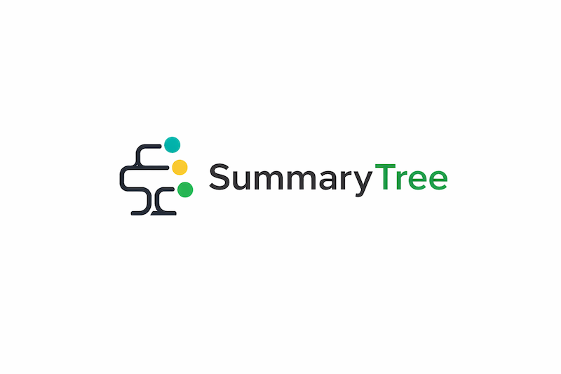
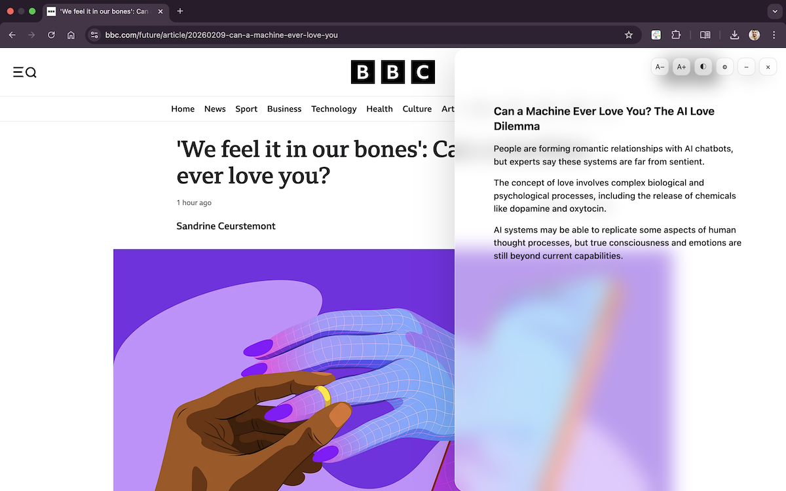
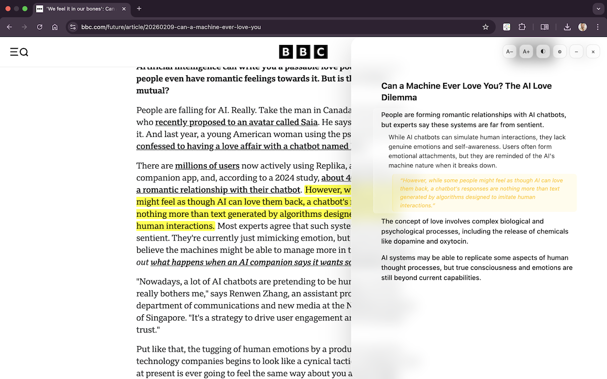
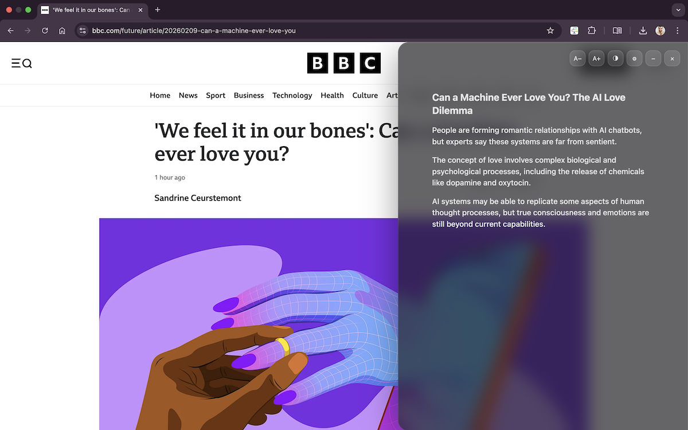
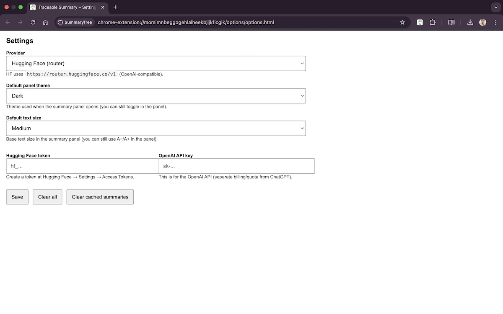
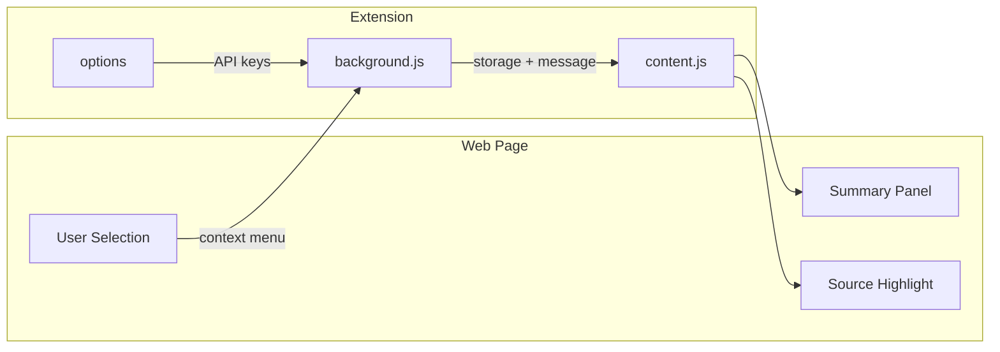

# SummaryTree – Source-Backed, Expandable AI Summaries

Chrome extension that turns selected text into a **traceable summary**: each bullet maps back to a verbatim source excerpt and can be highlighted on the page. No backend; BYOK (Bring Your Own Key) for Hugging Face or OpenAI.

  

## Features

- **Right-click summary**: Select text → right-click → “Traceable summary” (or “SummaryTree” in the menu).
- **Right-side panel**: In-page panel (not a popup) with a short title and expandable items.
- **Progressive disclosure**: Click an item to cycle Level 1 (short) → Level 2 (expanded) → Level 3 (verbatim excerpt). At Level 3, the excerpt is highlighted on the page.
- **BYOK**: Configure a Hugging Face token and/or OpenAI API key in Options. No keys are stored outside your browser.
- **Local cache**: Recent summaries cached in `chrome.storage.local` (LRU, ~30 entries) to avoid repeated API calls.
- **Options**: Provider choice (HF / OpenAI / auto), default panel theme and font size.

## Demo (flow)

1. Select 200+ characters on any page.
2. Right-click → **Traceable summary**.
3. Panel opens with summary items; click an item to expand and, at Level 3, see the source highlighted in the page.

**Summary panel with expandable items**

**Expanded item with source excerpt (Level 3)**

**Dark theme**

**Settings (BYOK)**

## Install (Chrome)

1. Clone the repo.
2. Open `chrome://extensions`, enable **Developer mode**, click **Load unpacked**.
3. Select the folder that contains `manifest.json`.

## Dev workflow

- **Run**: Load unpacked as above; reload the extension after code changes; refresh the tab for content script changes.
- **UI-only testing**: In `content.js`, set `DEV_UI_MODE = true` to open the panel with dummy data and no API calls.

## Architecture

- **background.js**: Service worker — context menu, selection limits, cache, LLM calls (HF router + OpenAI), sends results to the active tab.
- **content.js**: Injected on all URLs — builds the right-side panel, handles expand/collapse and source highlighting.
- **panel.css**: Panel styling (glassy UI, dark mode, minimize); must be listed in `web_accessible_resources` in `manifest.json`.
- **options/**: Settings page for provider and API keys.

## Permissions

- **contextMenus**: Right-click “Traceable summary”.
- **storage**: Cache and options (API keys, provider, panel preferences).
- **activeTab**: Access the current tab to send the summary to the content script.
- **host_permissions**: `https://router.huggingface.co/*` and `https://api.openai.com/*` for LLM requests when you provide keys.

## Privacy

- **Selection**: Selected text is sent only to Hugging Face and/or OpenAI when you have configured the corresponding API key. No other servers.
- **Storage**: API keys and cached summaries stay in your browser (`chrome.storage.local`). Nothing is sent to the extension author.
- **No telemetry or tracking.**

## Limitations / TODO

- Hugging Face free tier can hit quota quickly; OpenAI requires a paid key.
- Source highlighting may fail on very complex or dynamic DOMs.
- No streaming; summary appears when the full response is ready.
- Selection must be 200–15,000 characters.

## License

MIT — see [LICENSE](LICENSE).
